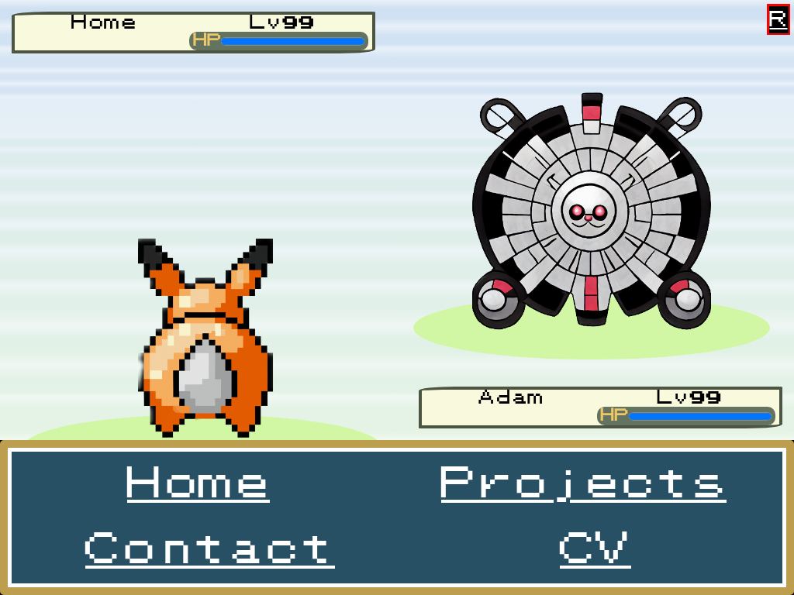

# React Portfolio

## Description

This is my portfolio page created using React.

The project had the following requirements:

- A navbar with links to the different pages.

- A clean and polished UI.

- Projects are displayed using a common project moule.

- At least 6 projects displayed on the page.

- A home page with my a bio and a picture.

- A contact form.

- A header that is common across all the pages.

## Table of Contents

- [Description](#description)

- [Table of Contents](#table-of-contents)

- [Installation](#installation)

- [Usage](#usage)

- [Features](#features)

- [Contributing](#contributing)

- [Credits](#credits)

- [License](#license)

- [Questions](#questions)

## Installation

Either run the page from [the web link](https://bowseruk.github.io/react-portfolio/), or clone the repo. If you clone the repo you can npm start to run a development server. When development is complete you can run npm run build.

## Usage

A screenshot of the project can be seen below:

To use this page, go to [the web link](https://bowseruk.github.io/react-portfolio/). Use the site on a modern version of chrome. Browse to the page you want. On the home page, open the retrodex using the R logo in the top right corner to see my bio. On the project page, use the arrows to change the project number (as seen in the opponent's name in their status bar) and then click on the retrodex icon.

## Features

This project has the following features:

- A single page website.

- Built using React and React Router

## Contributing

Please send a message or raise an issue if you want to contribute. You may send a pull request, but only after making contact or raising an issue.

## Tests

There are currently no tests for this project.

## Credits

The following resources were important for this project.

- [Readme Generator](https://github.com/bowseruk/readme-generator-nodejs) for generating the readme.

- [React](https://react.dev/) was used as a frontend framework.

- [React Router](https://reactrouter.com/en/main) was used to allow changing of pages.

- The changes were checked with [W3C Validator](https://validator.w3.org/).

- [W3School](https://www.w3schools.com/) was used as a reference for elements to use and good practice.

- [MDN](https://developer.mozilla.org/en-US/) is a very comprehensive and useful resource.

- [Stack Overflow](https://stackoverflow.com/) always seems to have the answer to a problem that occurs.

- [Bootstrap](https://getbootstrap.com/) was used in this project using the documentation on their website.

- [Font Awesome](https://fontawesome.com/) was used and the documentation referenced.

- [Node.js](https://nodejs.org/) was used in the project, following documentation from their site.

- [Jest.js](https://jestjs.io/) was used as a testing framework for the project, following documentation from their site.

## License

This project is licensed under the [MIT](https://opensource.org/licenses/MIT) license.

This full license used by the project is in the LICENSE file of the repo.

## Questions

Please contact me with any questions by:

- Github Discussion: Add a discussion or raise an issue on this repo.

- My Github Username is [BowserUK](https://github.com/bowseruk): Feel free to find more contact details or browse my other Repos.